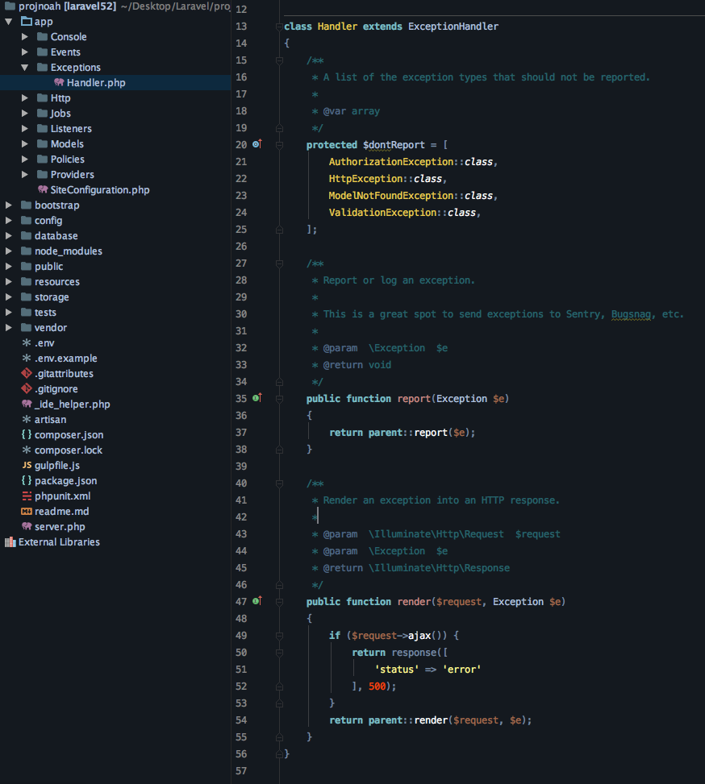
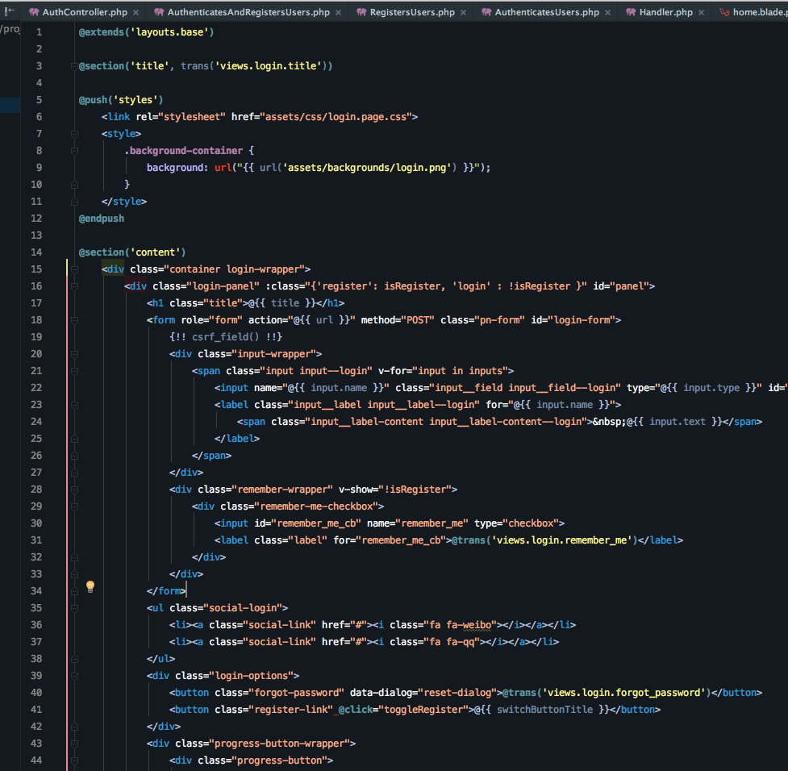

## Cali's PHPStorm Theme

Hi there, I'm Cali and I love developing with a beautiful color theme in my editor, nice and clean like the way I wanted it to be.

Anyways, if you like this theme, give me a star, thanks~!

## Installation
Simply copy `cali-theme.icls` to:

    ~/Library/Preferences/WebIde100(PHPStorm%%%%)/colors
    
For windows: copy the file under the following path:

    %USERPROFILE%\.WebIde100\config\colors
    
    
## Screenshots

## Notice
The UI theme used in the screenshot is the Material UI theme by [Chris Magnussen](https://github.com/ChrisRM). You'll find instructions for installing it over at [his repository](https://github.com/ChrisRM/material-theme-jetbrains).
